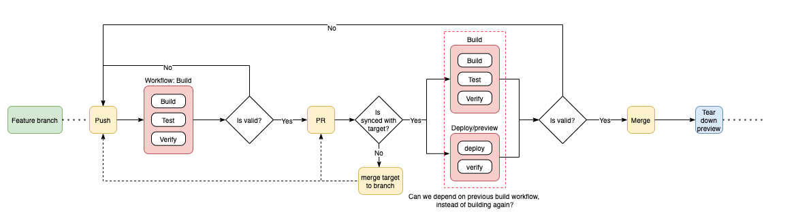
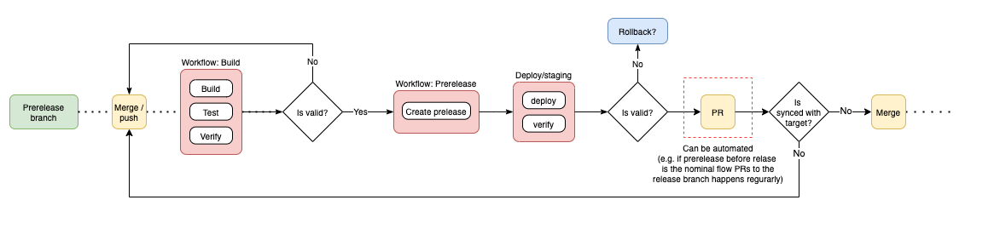

# Pipeline-lab

This is a lab project for testing out workflows with github actions.

The aim is to make and keep it generic with regards of no partilar underlying technology.
This is partially true as it will utilize [conventional commits](https://www.conventionalcommits.org/en/v1.0.0/) and particularily [semantic-release](https://github.com/semantic-release/semantic-release) to automate the release process.

Outside of that the workflow files for this particular project will be technology agnostic (although it was initally scaffolded for nextjs).
The idea is to fork the repo to try out different technology stacks.

## Workflow

The theory behind the workflow currently looks like:

The visualization make no distinction of how the different branches should be used.

Initially a nominal workflow was visualized. Illustrating how the different branches was made to be used in conjunction and automate processes between them.
The idea was to automate the complete release process:   
`feature/fix/...` -> `prerelease (staging)`-> `release (prod)`

Instead the branches are now viusalized completely separate and a user can decide for themself how to work with them. That way it's possible to create a flow working with both `previews`, `prereleases` and/or `releases`.

### Feature branches

The feature branches are the heart of the development cycle.

The current setup treats all branches as `feature` branches.

When a change is ready it should be merged into any of the other branches, moving the end-to-end workflow forward.

A `PR` should deploy a preview which will (preferably) be automatically verified, manually where automation is not applicable.

An independent preview is favorable instead of deploying to a dev environment.
Deployment to a dev environment is usually easier, but if several features are worked on in parallel they might end up overwriting each other, needing syncronization between work.

Although a `PR` is filed when the work is ready to be brought in, it is still considered W.I.P as long as it's open (and there's communication going on between the participants of the PR).

It's not always the case that the work in a PR is ready for any of the hosting environments, until it's finally merged.

### Prerelease branches

Preleases can be utilized in a flow where you want to merge several changes before they are pushed to production.

It can also be utilized before each change but where you only want to verify in a `staging` and not pushing to production.

It will create a `pre-release` using `semantic-release`, this in turn triggers the prerelase deployment to staging.

The current setup is that all pushes to the branch will trigger the prerelease behavior, this includes merges to the branch as well.

This means that a merge to the branch will create a prerelease and trigger a deploy to staging.
Pushes to the branch without any version changes in between (e.g. a proper release merged into the branch, manual tags or version changes) will trigger the same prerelease behaviour but with the prerelease version 

Observe that prerelease branches are specified in both the [prerelease workflow](https://github.com/Visegue/pipeline-lab/blob/main/.github/workflows/prerelease.yml#L8) and the semantic-release [configuration](https://github.com/Visegue/pipeline-lab/blob/main/.releaserc#L12). These needs to be kept in sync.
It would be possible to specify branch behaviour in the `semantic-release` configuration. But then we would need to run `semantic-release`for each behavior to check if there's any action needed for the current branch.

By specifying the branches in both configurations we have finer control of when to run `semantic-release`, with the cost of having to keep them in sync.

When writing this the prerelease branch is named `rc`, which stands for `Relase Candidate`.
But this can be whatever we like, and even several branches.
The `semantic-release` default is `alpha`, and `beta`.

When a release candidate is ready for final release, create a `PR` and merge inte into the `default` branch, which should trigger release behavior.

#### Prerelase PR previews
Even though the there is no `preview` behavior visualized in the workflow graph for prerelease branches (not really required when pushing to staging), each `PR` will actually trigger a preview anyway.
This is a side-effect rather than intentional. 
The `preview` workflow file is [setup](https://github.com/Visegue/pipeline-lab/blob/main/.github/workflows/deploy_preview.yml#L6) without distinction for the `PR` target or base.
It's more unnecessary than unwanted, so it's left in.

Github Actions only have built in behavior for conditions on PR target branches. The current workflow allows merging from feature branches to both prerelease and release branches, as well as merges from prerelease to releases, thus the distinction can't be made with default workflow configuration.

If prerelease PR workflow is unwanted it is possible to remove it using at least two methods.
##### 1. Removing prerelease PR previews with nailed down workflow
By specifying that the workflow needs is fixed according to: `feature branch` -> `prerelase branch` ->  `release branch` it is possible to say that no previews should be created or deployed when merging to the release branch.
This is possible with the default github workflow configuration and as the workflow is to never push to release branches directly or from any other branch than prereleases, it can be configured to ignore previews to release branches.

By nailing down the workflow like this it's possible to reuse some build workflows and artifacts for different branches, if `Require branches to be up to date before merging` is enabled for PR to target branches, as the PR will always contain what's in the target branch.

It's also possible with further automations to reduce developer load (like automatic PR from `prerelease` -> `release`). This depends on how prereleases are used (smaller batches or contains several changes).

##### 2. Removing prerelease PR previews with gatekeeper workflow

When a workflow is actually run it is possible to deduce further information about the PR and what triggers the event.
It would be possible to create a gatekeeper job which first triggers and verifies if a preview is warranted, if so triggering the preview workflow file.
